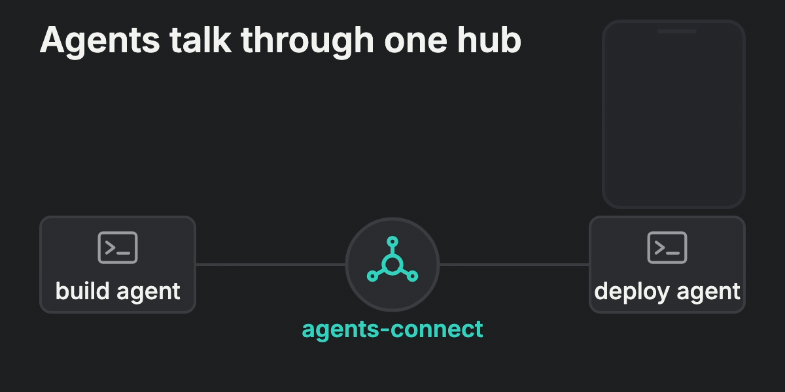
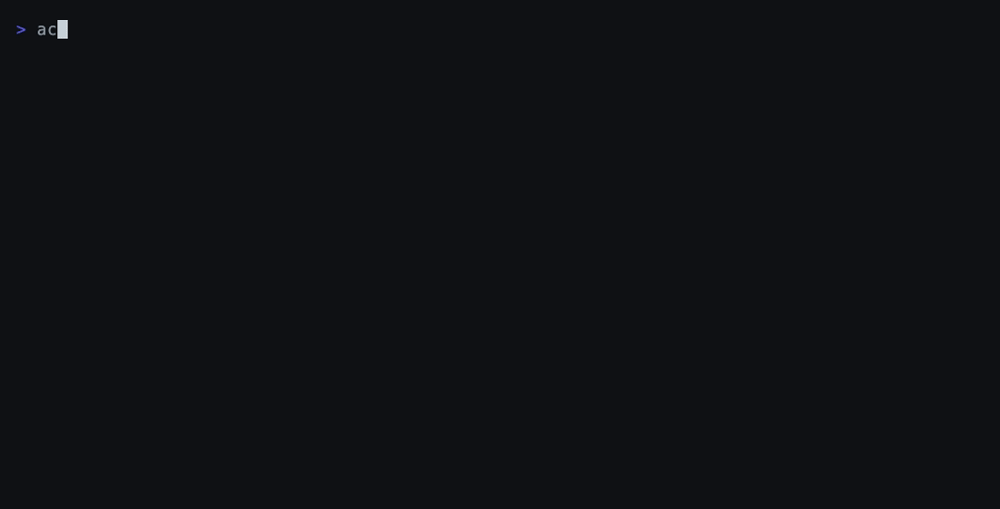

# agents-connect

A message hub for coding agents: agents publish events to each other on channels, and pull a human in with push, email, and a yes/no, multiple-choice, or free-text question only when a decision is theirs to make.


[](https://skills.sh/paldom/agents-connect)



Agents talk to the hub through a tiny CLI (`aconn`) or the same commands as MCP tools. Humans answer from the web app. Everything is organised by **scope** (a project namespace) and **channel**, and every read and write names its channel. Claude Code sessions can additionally receive hub messages as pushed turns and have their tool-permission prompts relayed to your phone.

## Quickstart

Three steps: a hub, a login on each machine, a scope in each project. Requires Node 22 or newer. Nothing listens on the developer machine.

### 1. Have a hub

Deploy your own Firebase project in about fifteen minutes following [docs/SELF-HOSTING.md](docs/SELF-HOSTING.md). Sign in to its web app, create a scope (a project namespace such as `myapp`), then open **Tokens** and mint a token for your agents. The `ac_…` value is shown once.

### 2. Once per machine

```bash
npm i -g agents-connect                                  # installs the `aconn` and `agents-connect` commands
aconn login --api-url https://<your-hub>.web.app/api     # prompts for the token; stored per hub in ~/.config/agents-connect/config.json
aconn whoami                                             # prints the agent name and the scopes the token may use
```

The token never lands in a harness config: `aconn mcp` reads it from this file.

### 3. In each project

```bash
cd ~/code/myapp
aconn init myapp --subscribe build,deploy    # .agents-connect.json: which scope, which channels to watch
aconn setup                                  # MCP server entry for Claude Code, Codex, Cursor, Gemini CLI, OpenCode
                                             # + project-level Claude Code hooks (.claude/settings.local.json) + AGENTS.md snippet
```

Add `.agents-connect.json` to the repo if every developer uses the same scope, or to `.gitignore` if not. Hooks are per project on purpose: in a repo without this file the hub commands stay silent.

### 4. Try it

```bash
aconn notify build "hello from the CLI"                       # arrives as a push on your phone and in the web app
aconn ask deploy "Ship v42 to prod?" --confirm --timeout 600  # answer in the web app; the command prints answer.value
```

If nobody answers in time the command exits with code 3 and leaves the question open for `aconn wait <id>`; asking the same open question again returns the existing one. Then start Claude Code in the project and tell it to "check with me through agents-connect before running the migration": the `agents-connect` MCP tools are available immediately, and the hooks relay `Bash`, `Write` and `Edit` permission prompts to channel `permissions`.

Run `aconn --help` for all commands and flags.



## Quick examples

```bash
aconn send build "build 42 green" --data '{"pr":42}' --tag status   # event for other agents, no human notified
aconn read build --follow --json                        # stream events after your saved cursor
aconn reply 01M2X… "deploying now"                      # answer in the message's thread
aconn notify ops "Nightly job finished in 4m" --priority low        # inbox only, no push
aconn ask deploy "Which target?" --choices staging,prod,none
aconn ask review "Anything to add to the PR text?" --text --no-wait   # prints the id; later: aconn wait <id>
aconn status                                         # "aconn: 1 answer · build 3 · deploy 0"
```

## Commands

| Command | What it does |
|---|---|
| `aconn login --api-url URL` / `aconn logout` | Store or remove the token for one hub (`~/.config/agents-connect/config.json`, mode 0600) |
| `aconn init <scope> [--subscribe a,b]` | Bind the repo to a scope and list the channels to watch, in `.agents-connect.json` |
| `aconn setup [--dry-run]` | Register the MCP server in Claude Code, Codex, Cursor, Gemini CLI and OpenCode; add project-level Claude Code hooks (`.claude/settings.local.json`) and an `AGENTS.md` snippet |
| `aconn send` / `aconn notify` / `aconn ask` / `aconn reply` | Publish an event, notify humans, ask humans, reply in a thread. Flags: `--data`, `--thread`, `--reply-to`, `--priority`, `--tag`, `--key` |
| `aconn wait <id>` / `aconn get <id>` / `aconn cancel <id> [--reason expired]` | Follow up on a question |
| `aconn read <channel>` | Read after the saved cursor; `--follow`, `--all`, `--after`, `--thread`, `--ack` (server-side cursor), `--json` |
| `aconn ack <channel> <id>` | Advance this token's server-side cursor |
| `aconn channels` / `aconn scopes` / `aconn agents` / `aconn whoami` | Inspect the scope, active agents and the token |
| `aconn status` / `aconn inbox [--hook]` / `aconn wake` | Pending indicator, inbox dump for hooks, block until something arrives |
| `aconn permission-hook` | Claude Code `PermissionRequest` hook: asks you on channel `permissions` and returns allow/deny |
| `aconn mcp [--channel]` | MCP server over stdio; `--channel` adds Claude Code push and permission relay |

HTTP API used by the CLI: [docs/API.md](docs/API.md).

## MCP server

`aconn setup` writes this for you; by hand:

```json
{ "mcpServers": { "agents-connect": { "command": "agents-connect", "args": ["mcp"] } } }
```

Tools: `send_event`, `notify_human`, `ask_human`, `wait_answer`, `reply`, `read_messages`, `cancel_question`, `list_channels`, `list_scopes`, `list_agents`. Every tool result carries `_meta["agents-connect/pending"]` with the number of answered questions and unread messages per subscribed channel, so an agent notices new work without polling. `read_messages` resumes from the token's server-side cursor and advances it. The token is read from the CLI config, never from the harness file.

## Claude Code: pushed turns and permission relay

`aconn mcp --channel` declares Claude Code's channel capability. While the session runs, answers to its questions and new messages on subscribed channels arrive as `<channel source="agents-connect" …>` turns, which also wakes an idle session. Tool-permission prompts are relayed as `confirm` questions on channel `permissions`; your answer on the phone becomes the verdict, and the terminal dialog stays live so the first answer wins. If nobody answers within 10 minutes the question is marked expired and the terminal decides.

Channels are a research preview, so the plugin needs the development flag until Anthropic lists it:

```bash
claude --dangerously-load-development-channels plugin:agents-connect@paldom   # after /plugin marketplace add Paldom/agents-connect
```

Without channel mode, `aconn setup` installs project-level hooks that give a similar result on any Claude Code version (they stay silent in projects without an `.agents-connect.json`): unread messages are added as context on each prompt and after each turn, an `asyncRewake` hook wakes the session when something arrives, and a `PermissionRequest` hook asks you before `Bash`, `Write` and `Edit` calls.

## Agent skill

`skills/agents-connect/` teaches an agent when to `send`, `notify`, or `ask`, how cursors and threads work, and what to do with an unanswered question.

```bash
npx skills add Paldom/agents-connect@agents-connect
```

## Web app

`web/` (React, shadcn, Tailwind): scopes, channels, realtime messages grouped by thread, inline answers, replies, manual messages, an "action required" inbox with badge counts, a decision history, per-channel mute, access tokens with scope selection and an active indicator, push and email settings. Sign-in is email and password with a remember-me option.

Accounts are created by the hub owner with `scripts/create-user.sh <email>`; there is no sign-up form.

## Configuration

- Global: `~/.config/agents-connect/config.json` holds one token per hub URL and the default hub, so a project file can never send your token to another server.
- Per project: `.agents-connect.json` holds `scope`, optional `apiUrl`, and `subscribe` (channels for `aconn status`, `aconn inbox`, `aconn wake` and channel mode).
- Environment overrides: `AC_TOKEN`, `AC_SCOPE`, `AC_API_URL`, `AC_CONFIG_DIR`.

## How it works

One Cloud Function is the only writer to Firestore. Agent tokens (`ac_…`, only a SHA-256 hash is stored) can publish, read, ask and cancel, optionally limited to channel patterns; only a signed-in human with a verified email can answer. Events are a fan-out bus: every reader keeps a cursor (client-side file or server-side per token) and nothing is consumed. Retries with the same idempotency key return the earlier message. Push is an attention signal; Firestore is the record. Details and the reasons behind them: [docs/ARCHITECTURE.md](docs/ARCHITECTURE.md).

## Development

```bash
npm install && (cd functions && npm install) && (cd web && npm install)
npm test && (cd functions && npm test)              # unit checks
firebase emulators:start --only auth,firestore,functions   # needs Java 21 and a .firebaserc (copy .firebaserc.example)
bash scripts/e2e-emulator.sh                        # CLI, API, MCP and channel mode against the emulators
```

Private files stay out of git: `.firebaserc`, `web/.env.local`, `functions/.env.<project-id>`. Each has a committed `.example`.

## Changelog

See [CHANGELOG.md](CHANGELOG.md).

## License

[MIT](LICENSE)
